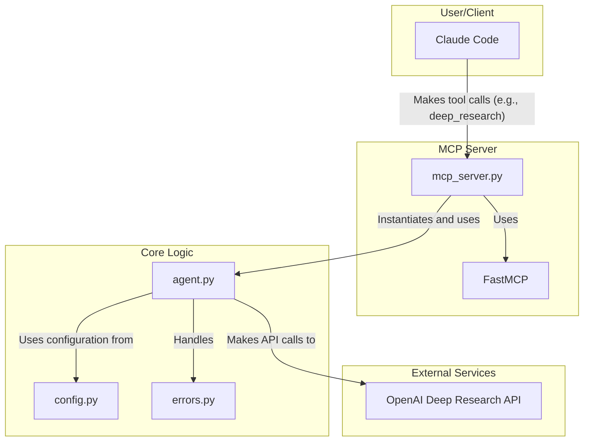

# Architecture

This document provides a detailed overview of the `deep-research-mcp` project architecture, including component interactions and file-by-file descriptions.

## Architectural Diagram (Mermaid)

## Component Descriptions

The project is composed of three main layers:

1.  **MCP Server (`mcp_server.py`)**: This is the entry point for external clients like Claude Code. It uses the `fastmcp` library to expose the core research functionality as tools. It handles incoming requests, initializes the `DeepResearchAgent`, and formats the results for the client.

2.  **Core Logic (`agent.py`, `config.py`, `errors.py`)**: This layer contains the main business logic of the application.
    *   `agent.py` is the heart of the project, managing the interaction with the OpenAI Deep Research API.
    *   `config.py` handles loading and validating configuration from environment variables.
    *   `errors.py` defines custom exception classes for better error handling.

3.  **External Services**: This layer represents the external APIs the project interacts with, primarily the OpenAI Deep Research API.

## File-by-File Breakdown

### `src/deep_research_mcp/agent.py`

-   **Purpose**: Contains the `DeepResearchAgent` class, which is the core component responsible for interacting with the OpenAI Deep Research API.
-   **Key Functionality**:
    -   `research()`: The main method that orchestrates the research process. It prepares the input, creates a research task, polls for completion, and formats the results.
    -   `_create_research_task()`: Sends the initial request to the OpenAI API to start a research task. It includes retry logic using the `tenacity` library.
    -   `_wait_for_completion()`: Polls the API for the status of a research task until it is completed, fails, or times out.
    -   `_send_completion_callback()`: Sends a notification to a callback URL when the research is complete.
    -   `_extract_results()`: Parses the final response from the API and extracts the report, citations, and other metadata.
    -   `get_task_status()`: Allows checking the status of a running research task.

### `src/deep_research_mcp/mcp_server.py`

-   **Purpose**: Implements the MCP (Model-Client Protocol) server using the `fastmcp` library. This file exposes the research functionality as tools that can be called by clients like Claude Code.
-   **Key Functionality**:
    -   `@mcp.tool() deep_research()`: The main tool that performs research. It initializes the `DeepResearchAgent`, calls its `research()` method, and formats the output for the client.
    -   `@mcp.tool() research_status()`: A tool to check the status of a research task.
    -   `@mcp.tool() list_models()`: A tool to list the available Deep Research models.
    -   `main()`: The entry point for running the MCP server. It loads the configuration and starts the server.

### `src/deep_research_mcp/config.py`

-   **Purpose**: Manages the application's configuration.
-   **Key Functionality**:
    -   `ResearchConfig` (dataclass): Defines the configuration parameters for the agent, such as API key, model name, timeout, and poll interval.
    -   `from_env()`: A class method to load configuration from environment variables using the `dotenv` library. This allows for easy configuration without hardcoding values.
    -   `validate()`: A method to validate the configuration to ensure that the provided values are valid.

### `src/deep_research_mcp/errors.py`

-   **Purpose**: Defines custom exception classes for the application.
-   **Key Functionality**:
    -   `ResearchError`: A base exception class for all research-related errors.
    -   `RateLimitError`: An exception for when the API rate limit is exceeded.
    -   `TaskTimeoutError`: An exception for when a research task takes too long to complete.
    -   `ConfigurationError`: An exception for errors in the application's configuration.

### `src/deep_research_mcp/__init__.py`

-   **Purpose**: Initializes the `deep_research_mcp` package.
-   **Key Functionality**:
    -   Defines the package version (`__version__`).
    -   Exports the main classes and exceptions for easy importing.
