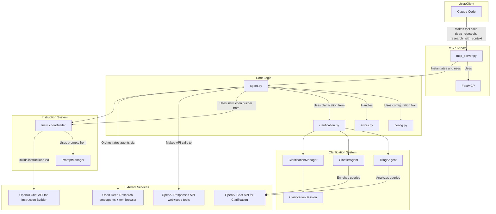

# Architecture

This document provides a detailed overview of the `deep-research-mcp` project architecture, including component interactions and file-by-file descriptions.

## Architectural Diagram



## Component Descriptions

The project is composed of four main layers:

1.  **MCP Server (`mcp_server.py`)**: This is the entry point for external clients like Claude Code. It uses the `fastmcp` library to expose the core research functionality as tools. It handles incoming requests, initializes the `DeepResearchAgent`, and formats the results for the client. Now includes three tools: `deep_research()`, `research_with_context()`, and `research_status()`.

2.  **Core Logic (`agent.py`, `config.py`, `errors.py`)**: This layer contains the main business logic of the application.
    *   `agent.py` is the heart of the project, managing provider-based research interactions and coordinating clarification workflows. Supports OpenAI (Responses API) when provider is `"openai"` and Open Deep Research (smolagents) when provider is `"open-deep-research"`.
    *   `config.py` handles loading and validating configuration from environment variables, including provider selection and clarification settings.
    *   `errors.py` defines custom exception classes for better error handling.

3.  **Clarification System (`clarification.py`)**: This layer handles the optional clarification workflow to improve research quality through follow-up questions.
    *   `TriageAgent` analyzes queries to determine if clarification would be beneficial.
    *   `ClarifierAgent` enriches queries based on user responses to clarifying questions.
    *   `ClarificationManager` orchestrates the complete clarification workflow.
    *   `ClarificationSession` manages state for individual clarification sessions.

4.  **Instruction System (`agent.py`, `prompts.py`)**: This layer handles the mandatory instruction building process to enhance research queries.
    *   `InstructionBuilder` (in `agent.py`) converts basic queries into detailed research briefs using the instruction builder model.
    *   `PromptManager` manages loading and formatting of YAML-based prompt templates, including the instruction builder prompt.

5.  **External Services**: This layer represents the external systems used:
    * Provider `openai`: OpenAI Responses API (web search + code interpreter tools), OpenAI Chat API for clarification agents and instruction builder.
    * Provider `open-deep-research`: smolagents stack with a text browser and search tools; optional OpenAI-compatible LLM endpoint via LiteLLM.

## File-by-File Breakdown

### `src/deep_research_mcp/agent.py`

-   **Purpose**: Contains the `DeepResearchAgent` class, which is the core component responsible for interacting with research providers based on configuration.
-   **Key Functionality**:
    -   `research()`: Orchestrates the research process. Builds enhanced instructions (if clarification enabled), then routes to OpenAI or Open Deep Research based on `config.provider`.
    -   `build_research_instruction()`: Converts basic queries into detailed research briefs using the instruction builder model (only when clarification is enabled).
    -   `_create_instruction_client()`: Creates OpenAI client for instruction builder using clarification settings or default config.
    -   `_create_openai_research_task()`: Starts an OpenAI background research task (Responses API) with retry logic.
    -   `_init_open_deep_research()`: Initializes smolagents model, browser, and tools for Open Deep Research.
    -   `_run_open_deep_research()`: Executes the ODR manager/search agents and extracts a structured result.
    -   `_wait_for_completion()`: Polls the API for the status of a research task until it is completed, fails, or times out.
    -   `_send_completion_callback()`: Sends a notification to a callback URL when the research is complete.
    -   `_extract_openai_results()`: Parses final OpenAI response and extracts report, citations, and metadata.
    -   `get_task_status()`: Allows checking the status of a running research task.
    -   `start_clarification()`: Initiates the clarification process using the ClarificationManager.
    -   `add_clarification_answers()`: Adds user answers to clarification questions.
    -   `get_enriched_query()`: Retrieves an enriched query based on clarification responses.

### `src/deep_research_mcp/mcp_server.py`

-   **Purpose**: Implements the MCP (Model-Client Protocol) server using the `fastmcp` library. Supports both stdio and HTTP (streaming) transports. Exposes the research functionality as tools that can be called by clients like Claude Code or any MCP‑compatible client.
-   **Key Functionality**:
    -   `@mcp.tool() deep_research()`: The main tool that performs research. It initializes the `DeepResearchAgent`, calls its `research()` method, and formats the output for the client. Now supports clarification via the `request_clarification` parameter.
    -   `@mcp.tool() research_with_context()`: A new tool that performs research using enriched queries from clarification sessions. Takes a session ID and answers to clarifying questions.
    -   `@mcp.tool() research_status()`: A tool to check the status of a research task.
    -   `main()`: The entry point for running the MCP server. It loads the configuration and starts the server. Transport is selectable via `--transport {stdio,http}` with `--host`/`--port` for HTTP.

### `src/deep_research_mcp/config.py`

-   **Purpose**: Manages the application's configuration.
-   **Key Functionality**:
    -   `ResearchConfig` (dataclass): Defines the configuration parameters for the agent, such as API key, model name, base URL, timeout, poll interval, clarification settings, and instruction builder model.
    -   `from_env()`: A class method to load configuration from environment variables. Configuration is loaded from a `~/.deep_research` TOML file that sets environment variables. This allows for easy configuration without hardcoding values. Now includes clarification and instruction builder settings.
    -   `validate()`: A method to validate the configuration to ensure that the provided values are valid.

### `src/deep_research_mcp/errors.py`

-   **Purpose**: Defines custom exception classes for the application.
-   **Key Functionality**:
    -   `ResearchError`: A base exception class for all research-related errors.
    -   `TaskTimeoutError`: An exception for when a research task takes too long to complete.
    -   `ConfigurationError`: An exception for errors in the application's configuration.


### `src/deep_research_mcp/clarification.py`

-   **Purpose**: Implements the clarification system for improving research quality through follow-up questions.
-   **Key Functionality**:
    -   `TriageAgent`: Analyzes research queries to determine if clarification would improve results. Uses configurable model for query analysis.
    -   `ClarifierAgent`: Takes user responses to questions and enriches the original query with additional context and specificity.
    -   `ClarificationSession`: Manages state for individual clarification sessions, including questions, answers, and session metadata.
    -   `ClarificationManager`: Orchestrates the complete workflow from triage through query enrichment, managing sessions and coordinating between agents.

### `src/deep_research_mcp/prompts/prompts.py`

-   **Purpose**: Implements the prompt management system for loading and formatting YAML-based prompt templates.
-   **Key Functionality**:
    -   `PromptManager`: Manages loading and formatting of YAML-based prompt templates with auto-discovery and package resource support.
    -   `get_instruction_builder_prompt()`: Loads and formats the instruction builder prompt template with query substitution.
    -   `get_triage_prompt()`: Loads and formats the triage analysis prompt for clarification.
    -   `get_enrichment_prompt()`: Loads and formats the query enrichment prompt for clarification.
    -   `list_available_prompts()`: Lists all available prompts by category for debugging and documentation.

### `src/deep_research_mcp/prompts/research/instruction_builder.yaml`

-   **Purpose**: Contains the YAML prompt template for converting research queries into detailed research briefs.
-   **Key Functionality**:
    -   Defines the instruction builder prompt that guides the instruction builder model to create comprehensive research instructions.
    -   Used by the research process to enhance basic queries before sending to the configured provider (only when clarification is enabled: `enable_clarification = true`).

### `src/deep_research_mcp/__init__.py`

-   **Purpose**: Initializes the `deep_research_mcp` package.
-   **Key Functionality**:
    -   Defines the package version (`__version__`).
    -   Exports the main classes and exceptions for easy importing.

## MCP Server Methods

The MCP server exposes three main tools to clients like Claude Code. Each tool accepts specific arguments and returns structured data.

### `deep_research()`

**Purpose**: Performs autonomous deep research using the configured provider (OpenAI Responses API or Open Deep Research).

**Arguments**:
- `query` (string, required): Research question or topic to investigate
- `system_instructions` (string, optional): Custom research approach instructions
- `include_analysis` (boolean, optional, default=True): Enable code execution for data analysis and visualizations  
- `request_clarification` (boolean, optional, default=False): Return clarifying questions instead of starting research

**Returns**: String containing formatted markdown report

**Return Structure**: When `request_clarification=False` (normal research):
```
# Research Report: [query]

[final_report content]

## Research Metadata
- **Total research steps**: [number]
- **Search queries executed**: [number]
- **Citations found**: [number]
- **Task ID**: [uuid]

## Citations
1. [Title](URL)
2. [Title](URL)
...
```

**Return Structure**: When `request_clarification=True`:
```
# Clarifying Questions Needed

**Original Query:** [query]
**Why clarification is helpful:** [reasoning]
**Session ID:** `[session_id]`

**Please answer these questions to improve the research:**

1. [Question 1]
2. [Question 2]
...

**Instructions:** Use the `research_with_context` tool with your answers and the session ID above.
```

**Example Successful Response Dictionary** (internal format before string formatting):
```python
{
    "status": "completed",
    "final_report": "# Introduction\nThis report examines...",
    "citations": [
        {"index": 1, "title": "Example Title", "url": "https://example.com"}
    ],
    "reasoning_steps": 5,
    "search_queries": ["quantum computing 2024", "latest breakthroughs"],
    "total_steps": 12,
    "task_id": "abc123-def456-ghi789"
}
```

### `research_status()`

**Purpose**: Check the status of a running research task.

**Arguments**:
- `task_id` (string, required): UUID returned by `deep_research()` tool

**Returns**: String containing task status information

**Return Structure**:
```
Task [task_id] status: [status]
Created at: [timestamp]
Completed at: [timestamp]  # Only if completed
```

**Example Response Dictionary** (internal format):
```python
{
    "task_id": "abc123-def456-ghi789",
    "status": "completed",  # or "running", "failed", "error"
    "created_at": "2025-01-15T10:30:00Z",
    "completed_at": "2025-01-15T10:35:00Z"
}
```

### `research_with_context()`

**Purpose**: Perform research using enriched queries from clarification sessions.

**Arguments**:
- `session_id` (string, required): Session ID from `deep_research()` with `request_clarification=True`
- `answers` (list[string], required): Answers to clarifying questions in order
- `system_instructions` (string, optional): Custom research approach instructions
- `include_analysis` (boolean, optional, default=True): Enable code execution for analysis

**Returns**: String containing formatted markdown report with enhanced context

**Return Structure**:
```
# Enhanced Research Report

**Original Query Enhanced With User Context**

**Enriched Query:** [enhanced_query]
**User Clarifications Provided:** [number] answers

---

[final_report content]

## Research Metadata
- **Total research steps**: [number]
- **Search queries executed**: [number] 
- **Citations found**: [number]
- **Task ID**: [uuid]
- **Clarification Session**: [session_id]

## Citations
1. [Title](URL)
2. [Title](URL)
...
```

**Example Response Dictionary** (internal format, same as `deep_research()`):
```python
{
    "status": "completed",
    "final_report": "# Enhanced Analysis\nBased on your clarifications...",
    "citations": [
        {"index": 1, "title": "Specific Source", "url": "https://specific.com"}
    ],
    "reasoning_steps": 7,
    "search_queries": ["enhanced query terms", "specific context"],
    "total_steps": 15,
    "task_id": "def456-ghi789-jkl012"
}
```

## Clarification System Return Types

The clarification system uses several internal dictionary structures:

**Triage Result** (from `TriageAgent.analyze_query()`):
```python
{
    "needs_clarification": True,  # boolean
    "reasoning": "Query would benefit from...",  # string
    "potential_clarifications": ["What time period?", "Which region?"],  # list[str]
    "query_assessment": "Query is too broad for optimal research"  # string
}
```

**Clarification Session Status** (from `add_clarification_answers()`):
```python
{
    "session_id": "session_abc123",  # string
    "status": "answers_recorded",  # string
    "total_questions": 3,  # int
    "answered_questions": 3,  # int  
    "is_complete": True  # boolean
}
```
