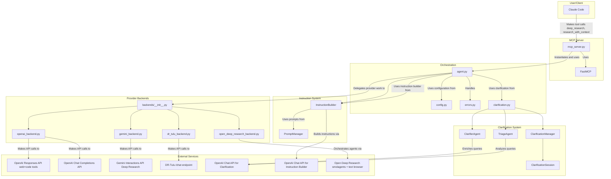

# Architecture

This document provides a detailed overview of the `deep-research-mcp` project architecture, including component interactions and file-by-file descriptions.

## Build and Dependency Management

- Packaging metadata is defined in `pyproject.toml` (PEP 621) using `setuptools` with a `src/` layout.
- Dependency constraints are minimum-version (`>=`) specifications in `pyproject.toml`.
- `requirements.txt` is a compatibility install file that also uses unpinned `>=` constraints.
- `uv.lock` is not tracked, so CI/dev environments resolve the latest compatible versions.
- The MCP server entrypoint is exposed as the console script `deep-research-mcp` (`deep_research_mcp.mcp_server:main`).

## Architectural Diagram


```mermaid
graph TD
    subgraph User/Client
        A[Claude Code]
    end

    subgraph MCP Server
        B[mcp_server.py]
        C[FastMCP]
    end

    subgraph Orchestration
        D[agent.py]
        E[config.py]
        F[errors.py]
        G[clarification.py]
    end

    subgraph Provider Backends
        P[backends/__init__.py]
        P1[openai_backend.py]
        P2[gemini_backend.py]
        P3[dr_tulu_backend.py]
        P4[open_deep_research_backend.py]
    end

    subgraph Clarification System
        G1[TriageAgent]
        G2[ClarifierAgent]
        G3[ClarificationManager]
        G4[ClarificationSession]
    end
    
    subgraph Instruction System
        J[InstructionBuilder]
        K[PromptManager]
    end

    subgraph External Services
        H[OpenAI Responses API web+code tools]
        H2[OpenAI Chat Completions API]
        H3[Gemini Interactions API Deep Research]
        H4[DR-Tulu /chat endpoint]
        I[OpenAI Chat API for Clarification]
        L[OpenAI Chat API for Instruction Builder]
        M[Open Deep Research smolagents + text browser]
    end

    A -- "Makes tool calls deep_research, research_with_context" --> B
    B -- "Uses" --> C
    B -- "Instantiates and uses" --> D
    D -- "Uses configuration from" --> E
    D -- "Handles" --> F
    D -- "Uses clarification from" --> G
    D -- "Uses instruction builder from" --> J
    D -- "Delegates provider work to" --> P
    P --> P1
    P --> P2
    P --> P3
    P --> P4
    P1 -- "Makes API calls to" --> H
    P1 -- "Makes API calls to" --> H2
    P2 -- "Makes API calls to" --> H3
    P3 -- "Makes API calls to" --> H4
    P4 -- "Orchestrates agents via" --> M
    
    G --> G1
    G --> G2
    G --> G3
    G3 --> G4
    G1 -- "Analyzes queries" --> I
    G2 -- "Enriches queries" --> I
    
    D --> J
    J -- "Uses prompts from" --> K
    J -- "Builds instructions via" --> L
```

## Component Descriptions

The project is composed of five main layers:

1.  **MCP Server (`mcp_server.py`)**: This is the entry point for external clients like Claude Code. It uses the `mcp.server.fastmcp` module from the official MCP Python SDK to expose the core research functionality as tools. It handles incoming requests, initializes the `DeepResearchAgent`, and formats the results for the client. Now includes three tools: `deep_research()`, `research_with_context()`, and `research_status()`.

2.  **Orchestration (`agent.py`, `config.py`, `errors.py`)**: This layer contains the application-facing orchestration logic.
    *   `agent.py` owns the top-level research flow, optional instruction building, clarification integration, completion callbacks, and delegation to the configured backend. It no longer embeds provider-specific execution logic directly.
    *   `config.py` handles loading and validating configuration from environment variables, including provider selection and clarification settings.
    *   `errors.py` defines custom exception classes for better error handling.

3.  **Clarification System (`clarification.py`)**: This layer handles the optional clarification workflow to improve research quality through follow-up questions.
    *   `TriageAgent` analyzes queries to determine if clarification would be beneficial.
    *   `ClarifierAgent` enriches queries based on user responses to clarifying questions.
    *   `ClarificationManager` orchestrates the complete clarification workflow.
    *   `ClarificationSession` manages state for individual clarification sessions.

4.  **Instruction System (`agent.py`, `prompts.py`)**: This layer handles the mandatory instruction building process to enhance research queries.
    *   `InstructionBuilder` (in `agent.py`) converts basic queries into detailed research briefs using the instruction builder model.
    *   `PromptManager` manages loading and formatting of YAML-based prompt templates, including the instruction builder prompt.

5.  **Provider Backends (`backends/`)**: This layer isolates provider-specific initialization, request execution, polling, and result extraction.
    *   `backends/base.py` defines the backend interface used by `DeepResearchAgent`.
    *   `backends/openai_backend.py` implements the OpenAI Responses API and Chat Completions flows, including citation extraction and background polling.
    *   `backends/gemini_backend.py` implements Gemini Deep Research over the Interactions API, including polling and result normalization.
    *   `backends/dr_tulu_backend.py` implements the DR-Tulu research agent integration via Allen AI's `/chat` endpoint.
    *   `backends/open_deep_research_backend.py` implements the Open Deep Research integration with smolagents and text-browser tooling.

6.  **External Services**: This layer represents the external systems used:
    * Provider `openai` with `api_style = "responses"` (default): OpenAI Responses API (web search + code interpreter tools), OpenAI Chat API for clarification agents and instruction builder.
    * Provider `openai` with `api_style = "chat_completions"`: OpenAI Chat Completions API -- works with any OpenAI-compatible provider (Perplexity, Groq, Ollama, vLLM, etc.). No built-in tools (web_search_preview, code_interpreter); no background mode or polling.
    * Provider `gemini`: Gemini Deep Research agent over the Interactions API. Background execution and polling are required; built-in Google Search and URL context are provided by Gemini.
    * Provider `dr-tulu`: Allen AI's DR-Tulu research agent accessed via its `/chat` endpoint. A lightweight integration that delegates research to a separately hosted DR-Tulu service.
    * Provider `open-deep-research`: smolagents stack with a text browser and search tools; optional OpenAI-compatible LLM endpoint via LiteLLM.

## File-by-File Breakdown

### `src/deep_research_mcp/agent.py`

-   **Purpose**: Contains the `DeepResearchAgent` class, which orchestrates research execution, clarification, instruction building, and callbacks.
-   **Key Functionality**:
    -   `research()`: Orchestrates the research process. Builds enhanced instructions (if clarification enabled), delegates research execution to the configured backend, and optionally triggers completion callbacks.
    -   `build_research_instruction()`: Converts basic queries into detailed research briefs using the instruction builder model (only when clarification is enabled).
    -   `build_research_instruction_async()`: Runs instruction building off the event loop in a worker thread.
    -   `_create_instruction_client()`: Creates OpenAI client for instruction builder using clarification settings or default config.
    -   `_send_completion_callback()`: Sends a notification to a callback URL when the research is complete.
    -   `get_task_status()`: Allows checking the status of a running research task.
    -   `start_clarification()`: Initiates the clarification process using the ClarificationManager.
    -   `start_clarification_async()`: Async clarification entry point that keeps blocking model calls off the event loop.
    -   `add_clarification_answers()`: Adds user answers to clarification questions.
    -   `get_enriched_query()`: Retrieves an enriched query based on clarification responses.
    -   `get_enriched_query_async()`: Async enrichment lookup that keeps blocking model calls off the event loop.

### `src/deep_research_mcp/backends/__init__.py`

-   **Purpose**: Exposes the provider backend interface and backend factory.
-   **Key Functionality**:
    -   `build_research_backend()`: Selects the correct backend implementation for the configured provider.

### `src/deep_research_mcp/backends/base.py`

-   **Purpose**: Defines the shared backend contract used by the orchestration layer.
-   **Key Functionality**:
    -   `ResearchBackend`: Base interface for provider implementations.
    -   `_combine_system_prompt()`: Shared helper for combining top-level system instructions with the user query.

### `src/deep_research_mcp/backends/openai_backend.py`

-   **Purpose**: Implements OpenAI Responses API and Chat Completions execution paths.
-   **Key Functionality**:
    -   `research()`: Routes between Responses API and Chat Completions mode based on `api_style`.
    -   `_create_research_task()`: Starts an OpenAI background research task (Responses API) with retry logic.
    -   `_wait_for_completion()`: Polls the Responses API task until completion, failure, or timeout.
    -   `_extract_openai_results()`: Parses final OpenAI response and extracts report, citations, and metadata.
    -   `_run_chat_completions_research()`: Runs research via the Chat Completions API.
    -   `_create_chat_completions_request()`: Retry-wrapped Chat Completions API call.
    -   `_extract_chat_completions_results()`: Parses Chat Completions response into the standard output dict.
    -   `_extract_chat_completions_citations()`: Multi-layer citation extraction (Perplexity-style, annotation-based, regex fallback).
    -   `get_task_status()`: Returns OpenAI task status or an `unknown` status for Chat Completions mode.

### `src/deep_research_mcp/backends/gemini_backend.py`

-   **Purpose**: Implements Gemini Deep Research over the Interactions API.
-   **Key Functionality**:
    -   `_init_gemini()`: Initializes the Gemini `google-genai` client and Interactions resource with beta API settings.
    -   `_run_research()`: Starts a Gemini Deep Research background interaction and normalizes the completed result.
    -   `_wait_for_completion()`: Polls Gemini interaction status until completion, failure, or timeout.
    -   `_extract_results()`: Parses Gemini interaction outputs into the project's standard report/citation format.
    -   `get_task_status()`: Returns Gemini interaction status metadata.

### `src/deep_research_mcp/backends/dr_tulu_backend.py`

-   **Purpose**: Implements the DR-Tulu research agent integration.
-   **Key Functionality**:
    -   `research()`: Sends research queries to the DR-Tulu `/chat` endpoint and returns normalized results.
    -   `_normalize_citations()`: Converts DR-Tulu searched links into the standard citation format.
    -   `get_task_status()`: Returns an `unknown` status because DR-Tulu does not support persistent task tracking.

### `src/deep_research_mcp/backends/open_deep_research_backend.py`

-   **Purpose**: Implements the Open Deep Research integration using smolagents and browser tools.
-   **Key Functionality**:
    -   `_init_open_deep_research()`: Initializes smolagents model, browser, and tools for Open Deep Research.
    -   `_run_research()`: Executes the ODR manager/search agents and extracts a structured result.
    -   `_extract_memory_details()`: Collects citations, search queries, and step counts from agent memory.
    -   `get_task_status()`: Returns an `unknown` status because the provider does not support persistent task tracking.

### `src/deep_research_mcp/mcp_server.py`

-   **Purpose**: Implements the MCP (Model-Client Protocol) server using the `mcp.server.fastmcp` module from the official MCP Python SDK. Supports both stdio and HTTP (streaming) transports. Exposes the research functionality as tools that can be called by clients like Claude Code or any MCP‑compatible client.
-   **Key Functionality**:
    -   `@mcp.tool() deep_research()`: The main tool that performs research. It initializes the `DeepResearchAgent`, calls its `research()` method, and formats the output for the client. Now supports clarification via the `request_clarification` parameter.
    -   `@mcp.tool() research_with_context()`: A new tool that performs research using enriched queries from clarification sessions. Takes a session ID and answers to clarifying questions.
    -   `@mcp.tool() research_status()`: A tool to check the status of a research task.
    -   `main()`: The entry point for running the MCP server. It loads the configuration and starts the server. Transport is selectable via `--transport {stdio,http}` with `--host`/`--port` for HTTP.

### `src/deep_research_mcp/config.py`

-   **Purpose**: Manages the application's configuration.
-   **Key Functionality**:
    -   `ResearchConfig` (dataclass): Defines the configuration parameters for the agent, such as API key, model name, base URL, `api_style` (`"responses"` or `"chat_completions"`), timeout, poll interval, clarification settings, and instruction builder model.
    -   `load()`: Explicitly reads `~/.deep_research` (or another provided TOML path), merges it with environment variable overrides, and returns a config object without mutating `os.environ`.
    -   `from_env()`: A class method to load configuration from environment variables only.
    -   `validate()`: A method to validate the configuration to ensure that the provided values are valid.

### `src/deep_research_mcp/errors.py`

-   **Purpose**: Defines custom exception classes for the application.
-   **Key Functionality**:
    -   `ResearchError`: A base exception class for all research-related errors.
    -   `TaskTimeoutError`: An exception for when a research task takes too long to complete.
    -   `ConfigurationError`: An exception for errors in the application's configuration.


### `src/deep_research_mcp/clarification.py`

-   **Purpose**: Implements the clarification system for improving research quality through follow-up questions.
-   **Key Functionality**:
    -   `TriageAgent`: Analyzes research queries to determine if clarification would improve results. Uses configurable model for query analysis.
    -   `ClarifierAgent`: Takes user responses to questions and enriches the original query with additional context and specificity.
    -   `ClarificationSession`: Manages state for individual clarification sessions, including questions, answers, and session metadata.
    -   `ClarificationManager`: Orchestrates the complete workflow from triage through query enrichment, managing sessions and coordinating between agents.

### `src/deep_research_mcp/prompts/prompts.py`

-   **Purpose**: Implements the prompt management system for loading and formatting YAML-based prompt templates.
-   **Key Functionality**:
    -   `PromptManager`: Manages loading and formatting of YAML-based prompt templates with auto-discovery and package resource support.
    -   `get_instruction_builder_prompt()`: Loads and formats the instruction builder prompt template with query substitution.
    -   `get_triage_prompt()`: Loads and formats the triage analysis prompt for clarification.
    -   `get_enrichment_prompt()`: Loads and formats the query enrichment prompt for clarification.

### `src/deep_research_mcp/prompts/research/instruction_builder.yaml`

-   **Purpose**: Contains the YAML prompt template for converting research queries into detailed research briefs.
-   **Key Functionality**:
    -   Defines the instruction builder prompt that guides the instruction builder model to create comprehensive research instructions.
    -   Used by the research process to enhance basic queries before sending to the configured provider (only when clarification is enabled: `enable_clarification = true`).

### `src/deep_research_mcp/__init__.py`

-   **Purpose**: Initializes the `deep_research_mcp` package.
-   **Key Functionality**:
    -   Defines the package version (`__version__`).
    -   Exports the main classes and exceptions for easy importing.

## MCP Server Methods

The MCP server exposes three main tools to clients like Claude Code. Each tool accepts specific arguments and returns structured data.

### `deep_research()`

**Purpose**: Performs autonomous deep research using the configured provider (OpenAI Responses API, Gemini Deep Research, DR-Tulu, or Open Deep Research).

**Arguments**:
- `query` (string, required): Research question or topic to investigate
- `system_instructions` (string, optional): Custom research approach instructions
- `include_analysis` (boolean, optional, default=True): Enable code execution for data analysis and visualizations  
- `request_clarification` (boolean, optional, default=False): Return clarifying questions instead of starting research
- `callback_url` (string, optional): Webhook URL notified with a completion payload after research finishes

**Returns**: String containing formatted markdown report

**Return Structure**: When `request_clarification=False` (normal research):
```
# Research Report: [query]

[final_report content]

## Research Metadata
- **Total research steps**: [number]
- **Search queries executed**: [number]
- **Citations found**: [number]
- **Task ID**: [uuid]
- **Execution time**: [seconds]

## Citations
1. [Title](URL)
2. [Title](URL)
...
```

**Return Structure**: When `request_clarification=True`:
```
# Clarifying Questions Needed

**Original Query:** [query]
**Why clarification is helpful:** [reasoning]
**Session ID:** `[session_id]`
**Created At:** [timestamp]

**Please answer these questions to improve the research:**

1. [Question 1]
2. [Question 2]
...

**Instructions:** Use the `research_with_context` tool with your answers and the session ID above.
```

**Example Successful Response Dictionary** (internal format before string formatting):
```python
{
    "status": "completed",
    "final_report": "# Introduction\nThis report examines...",
    "citations": [
        {"index": 1, "title": "Example Title", "url": "https://example.com"}
    ],
    "reasoning_steps": 5,
    "search_queries": ["quantum computing 2024", "latest breakthroughs"],
    "total_steps": 12,
    "task_id": "abc123-def456-ghi789"
}
```

### `research_status()`

**Purpose**: Check the status of a running research task.

**Arguments**:
- `task_id` (string, required): UUID returned by `deep_research()` tool

**Returns**: String containing task status information

**Return Structure**:
```
Task [task_id] status: [status]
Created at: [timestamp]
Completed at: [timestamp]  # Only if completed
```

**Example Response Dictionary** (internal format):
```python
{
    "task_id": "abc123-def456-ghi789",
    "status": "completed",  # or "running", "failed", "error"
    "created_at": "2025-01-15T10:30:00Z",
    "completed_at": "2025-01-15T10:35:00Z"
}
```

### `research_with_context()`

**Purpose**: Perform research using enriched queries from clarification sessions.

**Arguments**:
- `session_id` (string, required): Session ID from `deep_research()` with `request_clarification=True`
- `answers` (list[string], required): Answers to clarifying questions in order
- `system_instructions` (string, optional): Custom research approach instructions
- `include_analysis` (boolean, optional, default=True): Enable code execution for analysis
- `callback_url` (string, optional): Webhook URL notified with a completion payload after research finishes

**Returns**: String containing formatted markdown report with enhanced context

**Return Structure**:
```
# Enhanced Research Report

**Original Query Enhanced With User Context**

**Enriched Query:** [enhanced_query]
**User Clarifications Provided:** [number] answers

---

[final_report content]

## Research Metadata
- **Total research steps**: [number]
- **Search queries executed**: [number] 
- **Citations found**: [number]
- **Task ID**: [uuid]
- **Clarification Session**: [session_id]
- **Execution time**: [seconds]

## Citations
1. [Title](URL)
2. [Title](URL)
...
```

**Example Response Dictionary** (internal format, same as `deep_research()`):
```python
{
    "status": "completed",
    "final_report": "# Enhanced Analysis\nBased on your clarifications...",
    "citations": [
        {"index": 1, "title": "Specific Source", "url": "https://specific.com"}
    ],
    "reasoning_steps": 7,
    "search_queries": ["enhanced query terms", "specific context"],
    "total_steps": 15,
    "task_id": "def456-ghi789-jkl012"
}
```

## Clarification System Return Types

The clarification system uses several internal dictionary structures:

**Triage Result** (from `TriageAgent.analyze_query()`):
```python
{
    "needs_clarification": True,  # boolean
    "reasoning": "Query would benefit from...",  # string
    "potential_clarifications": ["What time period?", "Which region?"],  # list[str]
    "query_assessment": "Query is too broad for optimal research"  # string
}
```

**Clarification Session Status** (from `add_clarification_answers()`):
```python
{
    "session_id": "session_abc123",  # string
    "status": "answers_recorded",  # string
    "total_questions": 3,  # int
    "answered_questions": 3,  # int  
    "is_complete": True  # boolean
}
```
