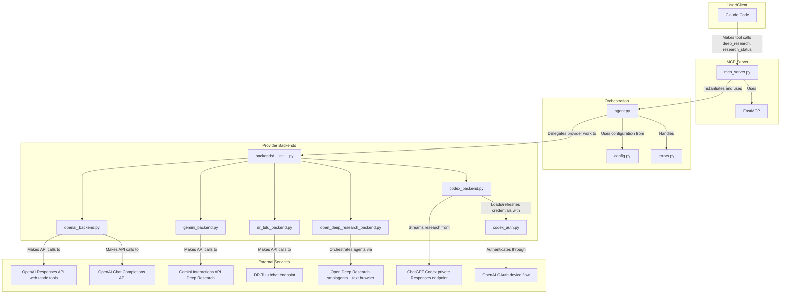

# Architecture

This document provides a detailed overview of the `deep-research-mcp` project architecture, including component interactions and file-by-file descriptions.

## Build and Dependency Management

- Packaging metadata is defined in `pyproject.toml` (PEP 621) using `setuptools` with a `src/` layout.
- Dependency constraints are minimum-version (`>=`) specifications in `pyproject.toml`.
- `requirements.txt` is a compatibility install file that also uses unpinned `>=` constraints.
- `uv.lock` is not tracked, so CI/dev environments resolve the latest compatible versions.
- Console scripts expose the MCP server as `deep-research-mcp`
  (`deep_research_mcp.mcp_server:main`) and the unified CLI, including Codex
  authentication, as `deep-research-cli` (`deep_research_mcp.cli:main`).

## Architectural Diagram


```mermaid
graph TD
    subgraph User/Client
        A[Claude Code]
    end

    subgraph MCP Server
        B[mcp_server.py]
        C[FastMCP]
    end

    subgraph Orchestration
        D[agent.py]
        E[config.py]
        F[errors.py]
    end

    subgraph Provider Backends
        P[backends/__init__.py]
        P1[openai_backend.py]
        P2[gemini_backend.py]
        P3[dr_tulu_backend.py]
        P4[open_deep_research_backend.py]
        P5[codex_backend.py]
        CA[codex_auth.py]
    end

    subgraph External Services
        H[OpenAI Responses API web+code tools]
        H2[OpenAI Chat Completions API]
        H3[Gemini Interactions API Deep Research]
        H4[DR-Tulu /chat endpoint]
        M[Open Deep Research smolagents + text browser]
        H5[ChatGPT Codex private Responses endpoint]
        OA[OpenAI OAuth device flow]
    end

    A -- "Makes tool calls deep_research, research_status" --> B
    B -- "Uses" --> C
    B -- "Instantiates and uses" --> D
    D -- "Uses configuration from" --> E
    D -- "Handles" --> F
    D -- "Delegates provider work to" --> P
    P --> P1
    P --> P2
    P --> P3
    P --> P4
    P --> P5
    P1 -- "Makes API calls to" --> H
    P1 -- "Makes API calls to" --> H2
    P2 -- "Makes API calls to" --> H3
    P3 -- "Makes API calls to" --> H4
    P4 -- "Orchestrates agents via" --> M
    P5 -- "Streams research from" --> H5
    P5 -- "Loads/refreshes credentials with" --> CA
    CA -- "Authenticates through" --> OA
```

## Component Descriptions

The project is composed of four main layers:

1.  **MCP Server (`mcp_server.py`)**: This is the entry point for external clients like Claude Code. It uses the `mcp.server.fastmcp` module from the official MCP Python SDK to expose the core research functionality as tools. It handles incoming requests, initializes the `DeepResearchAgent`, and formats the results for the client. It includes two tools: `deep_research()` and `research_status()`.

2.  **Orchestration (`agent.py`, `config.py`, `errors.py`)**: This layer contains the application-facing orchestration logic.
    *   `agent.py` owns the top-level research flow, completion callbacks, status lookup, and delegation to the configured backend. It does not embed provider-specific execution logic directly.
    *   `config.py` handles loading and validating configuration from environment variables, including provider selection.
    *   `errors.py` defines custom exception classes for better error handling.
    *   `cli.py` provides the installed direct-agent, MCP-client, configuration,
        and Codex authentication commands.

3.  **Provider Backends (`backends/`)**: This layer isolates provider-specific initialization, request execution, polling, and result extraction.
    *   `backends/base.py` defines the backend interface used by `DeepResearchAgent`.
    *   `backends/openai_backend.py` implements the OpenAI Responses API and Chat Completions flows, including citation extraction and background polling.
    *   `backends/gemini_backend.py` implements Gemini Deep Research over the Interactions API, including polling and result normalization.
    *   `backends/dr_tulu_backend.py` implements the DR-Tulu research agent integration via Allen AI's `/chat` endpoint.
    *   `backends/open_deep_research_backend.py` implements the Open Deep Research integration with smolagents and text-browser tooling.
    *   `backends/codex_backend.py` implements experimental ChatGPT subscription access through the private Codex Responses stream.
    *   `codex_auth.py` owns the separate device-code session, optional access-token-only Codex import, atomic token rotation, and local logout.

4.  **External Services**: This layer represents the external systems used:
    * Provider `openai` with `api_style = "responses"` (default): OpenAI Responses API with web search and code interpreter tools.
    * Provider `openai` with `api_style = "chat_completions"`: OpenAI Chat Completions API -- works with any OpenAI-compatible provider (Perplexity, Groq, Ollama, vLLM, etc.). No built-in tools (`web_search`, `code_interpreter`); no background mode or polling.
    * Provider `gemini`: Gemini Deep Research agent over the Interactions API. Background execution and polling are required; built-in Google Search and URL context are provided by Gemini.
    * Provider `dr-tulu`: Allen AI's DR-Tulu research agent accessed via its `/chat` endpoint. A lightweight integration that delegates research to a separately hosted DR-Tulu service.
    * Provider `open-deep-research`: smolagents stack with a text browser and search tools; optional OpenAI-compatible LLM endpoint via LiteLLM.
    * Provider `openai-codex`: account-scoped model discovery followed by a synchronous SSE Responses request with native web search. Code Interpreter, background polling, cancellation, task recovery, and endpoint overrides are intentionally unsupported.

## File-by-File Breakdown

### `src/deep_research_mcp/agent.py`

-   **Purpose**: Contains the `DeepResearchAgent` class, which orchestrates research execution, status lookup, and callbacks.
-   **Key Functionality**:
    -   `research()`: Passes the caller's query and system prompt unchanged to the configured backend and optionally triggers completion callbacks.
    -   `_send_completion_callback()`: Sends a notification to a callback URL when the research is complete.
    -   `get_task_status()`: Allows checking the status of a running research task.
    -   `get_task_result()`: Retrieves a completed task result when the backend supports recovery.

### `src/deep_research_mcp/cli.py`

-   **Purpose**: Implements the installed `deep-research-cli` console command.
-   **Key Functionality**:
    -   Runs direct research or connects to a Streamable HTTP MCP server.
    -   Displays resolved configuration and checks task status.
    -   Manages the independent OpenAI Codex login, status, and logout flows.

### `src/deep_research_mcp/backends/__init__.py`

-   **Purpose**: Exposes the provider backend interface and backend factory.
-   **Key Functionality**:
    -   `build_research_backend()`: Selects the correct backend implementation for the configured provider.

### `src/deep_research_mcp/backends/base.py`

-   **Purpose**: Defines the shared backend contract used by the orchestration layer.
-   **Key Functionality**:
    -   `ResearchBackend`: Base interface for provider implementations.
    -   `_combine_system_prompt()`: Shared helper for combining top-level system instructions with the user query.

### `src/deep_research_mcp/backends/openai_backend.py`

-   **Purpose**: Implements OpenAI Responses API and Chat Completions execution paths.
-   **Key Functionality**:
    -   `research()`: Routes between Responses API and Chat Completions mode based on `api_style`.
    -   `_create_research_task()`: Starts an OpenAI background research task (Responses API) with retry logic.
    -   `_wait_for_completion()`: Polls the Responses API task until completion, failure, or timeout.
    -   `_extract_openai_results()`: Parses final OpenAI response and extracts report, citations, and metadata.
    -   `_run_chat_completions_research()`: Runs research via the Chat Completions API.
    -   `_create_chat_completions_request()`: Retry-wrapped Chat Completions API call.
    -   `_extract_chat_completions_results()`: Parses Chat Completions response into the standard output dict.
    -   `_extract_chat_completions_citations()`: Multi-layer citation extraction (Perplexity-style, annotation-based, regex fallback).
    -   `get_task_status()`: Returns OpenAI task status or an `unknown` status for Chat Completions mode.

### `src/deep_research_mcp/backends/codex_backend.py`

-   **Purpose**: Isolates the undocumented ChatGPT Codex endpoint from the public OpenAI API backend.
-   **Key Functionality**:
    -   Fetches the signed-in account's ordered `/models` catalogue and resolves `model = "auto"`.
    -   Sends an honestly identified, web-search-enabled `/responses` request and assembles raw SSE deltas, annotations, searches, and terminal status.
    -   Retries once after a pre-stream `401`, but never retries a partially consumed stream.
    -   Returns `unknown` for task status because streamed results cannot be recovered.

### `src/deep_research_mcp/codex_auth.py`

-   **Purpose**: Manages the independent OpenAI Codex subscription OAuth session.
-   **Key Functionality**:
    -   Runs the Codex device-code flow and refreshes rotating tokens under a cross-process file lock.
    -   Stores credentials atomically in `~/.deep_research_auth.json` with owner-only permissions.
    -   Optionally imports only the current access token from `${CODEX_HOME:-~/.codex}/auth.json`, preventing refresh-token conflicts with Codex.
    -   Provides status and local logout operations used by the unified CLI.

### `src/deep_research_mcp/backends/gemini_backend.py`

-   **Purpose**: Implements Gemini Deep Research over the Interactions API.
-   **Key Functionality**:
    -   `_init_gemini()`: Initializes the Gemini `google-genai` client and Interactions resource with beta API settings.
    -   `_run_research()`: Starts a Gemini Deep Research background interaction and normalizes the completed result.
    -   `_wait_for_completion()`: Polls Gemini interaction status until completion, failure, or timeout.
    -   `extract_results()`: Parses Gemini interaction outputs into the project's standard report/citation format.
    -   `get_task_status()`: Returns Gemini interaction status metadata.

### `src/deep_research_mcp/backends/dr_tulu_backend.py`

-   **Purpose**: Implements the DR-Tulu research agent integration.
-   **Key Functionality**:
    -   `research()`: Sends research queries to the DR-Tulu `/chat` endpoint and returns normalized results.
    -   `_build_citations()`: Converts DR-Tulu searched links into the standard citation format.
    -   `get_task_status()`: Returns an `unknown` status because DR-Tulu does not support persistent task tracking.

### `src/deep_research_mcp/backends/open_deep_research_backend.py`

-   **Purpose**: Implements the Open Deep Research integration using smolagents and browser tools.
-   **Key Functionality**:
    -   `_init_open_deep_research()`: Initializes smolagents model, browser, and tools for Open Deep Research.
    -   `_run_research()`: Executes the ODR manager/search agents and extracts a structured result.
    -   `_extract_memory_details()`: Collects citations, search queries, and step counts from agent memory.
    -   `get_task_status()`: Returns an `unknown` status because the provider does not support persistent task tracking.

### `src/deep_research_mcp/mcp_server.py`

-   **Purpose**: Implements the MCP (Model-Client Protocol) server using the `mcp.server.fastmcp` module from the official MCP Python SDK. Supports both stdio and HTTP (streaming) transports. Exposes the research functionality as tools that can be called by clients like Claude Code or any MCP‑compatible client.
-   **Key Functionality**:
    -   `@mcp.tool() deep_research()`: The main tool that performs research. It initializes the `DeepResearchAgent`, calls its `research()` method, and formats the output for the client.
    -   `@mcp.tool() research_status()`: A tool to check the status of a research task.
    -   `main()`: The entry point for running the MCP server. It loads the configuration and starts the server. Transport is selectable via `--transport {stdio,http}` with `--host`/`--port` for HTTP.

### `src/deep_research_mcp/config.py`

-   **Purpose**: Manages the application's configuration.
-   **Key Functionality**:
    -   `ResearchConfig` (dataclass): Defines the configuration parameters for the agent, such as API key, model name, base URL, `api_style` (`"responses"` or `"chat_completions"`), timeout, and poll interval.
    -   `load()`: Explicitly reads `~/.deep_research` (or another provided TOML path), merges it with environment variable overrides, and returns a config object without mutating `os.environ`.
    -   `from_env()`: A class method to load configuration from environment variables only.
    -   `validate()`: A method to validate the configuration to ensure that the provided values are valid.

### `src/deep_research_mcp/errors.py`

-   **Purpose**: Defines custom exception classes for the application.
-   **Key Functionality**:
    -   `ResearchError`: A base exception class for all research-related errors.
    -   `TaskTimeoutError`: An exception for when a research task takes too long to complete.
    -   `ConfigurationError`: An exception for errors in the application's configuration.

### `src/deep_research_mcp/__init__.py`

-   **Purpose**: Initializes the `deep_research_mcp` package.
-   **Key Functionality**:
    -   Defines the package version (`__version__`).
    -   Exports the main classes and exceptions for easy importing.

## MCP Server Methods

The MCP server exposes two tools to clients like Claude Code. Each tool accepts specific arguments and returns structured data.

### `deep_research()`

**Purpose**: Performs autonomous deep research using the configured provider (OpenAI Responses API, experimental OpenAI Codex subscription access, Gemini Deep Research, DR-Tulu, or Open Deep Research).

**Arguments**:
- `query` (string, required): Complete research question, including any user-provided context needed to answer it
- `system_instructions` (string, optional): Custom research approach instructions
- `include_analysis` (boolean, optional, default=True): Enable code execution when the selected provider supports it
- `callback_url` (string, optional): Webhook URL notified with a completion payload after research finishes

**Returns**: String containing formatted markdown report

**Return Structure**:
```
# Research Report: [query]

[final_report content]

## Research Metadata
- **Total research steps**: [number]
- **Search queries executed**: [number]
- **Citations found**: [number]
- **Task ID**: [uuid]
- **Execution time**: [seconds]

## Citations
1. [Title](URL)
2. [Title](URL)
...
```

**Example Successful Response Dictionary** (internal format before string formatting):
```python
{
    "status": "completed",
    "final_report": "# Introduction\nThis report examines...",
    "citations": [
        {"index": 1, "title": "Example Title", "url": "https://example.com"}
    ],
    "reasoning_steps": 5,
    "search_queries": ["quantum computing 2024", "latest breakthroughs"],
    "total_steps": 12,
    "task_id": "abc123-def456-ghi789"
}
```

### `research_status()`

**Purpose**: Check the status of a running research task and recover the report of a completed one.

**Arguments**:
- `task_id` (string, required): UUID returned by `deep_research()` tool

**Returns**: String containing task status information. When the task is completed and the provider supports result retrieval (OpenAI Responses API, Gemini Interactions API), the full rendered research report is appended.

**Return Structure**:
```
Task [task_id] status: [status]
Created at: [timestamp]
Completed at: [timestamp]  # Only if completed

# Research Report (recovered): [task_id]  # Only if completed
...full report with metadata and citations...
```

**Example Response Dictionary** (internal format):
```python
{
    "task_id": "abc123-def456-ghi789",
    "status": "completed",  # or "running", "failed", "error"
    "created_at": "2025-01-15T10:30:00Z",
    "completed_at": "2025-01-15T10:35:00Z"
}
```
